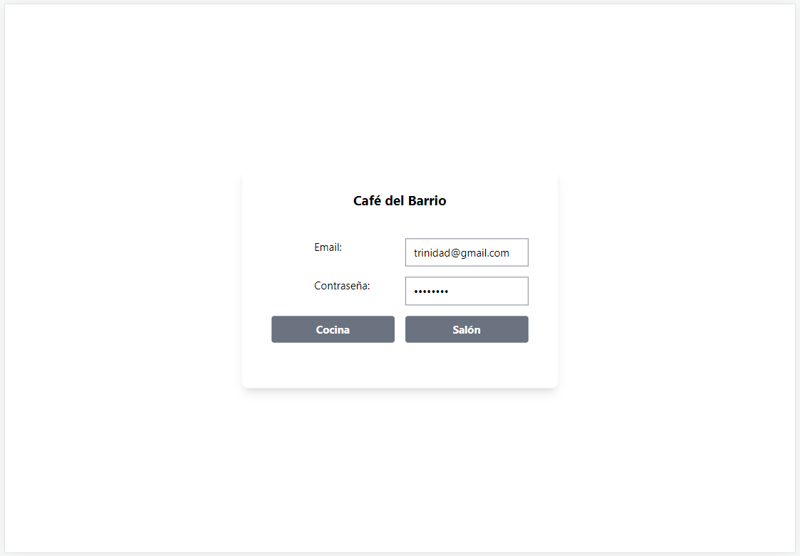
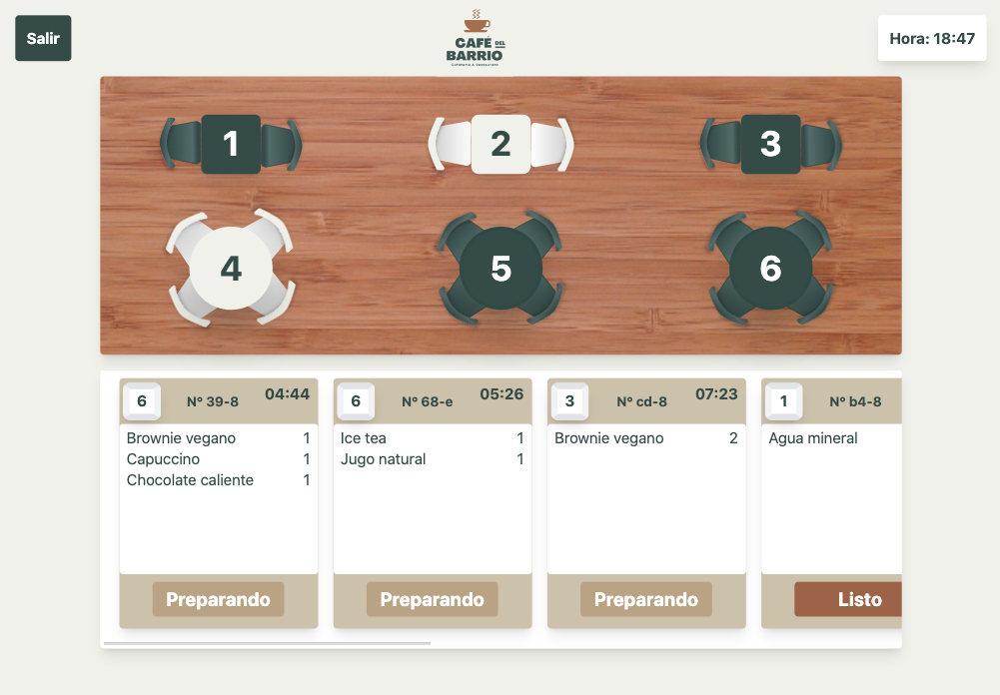
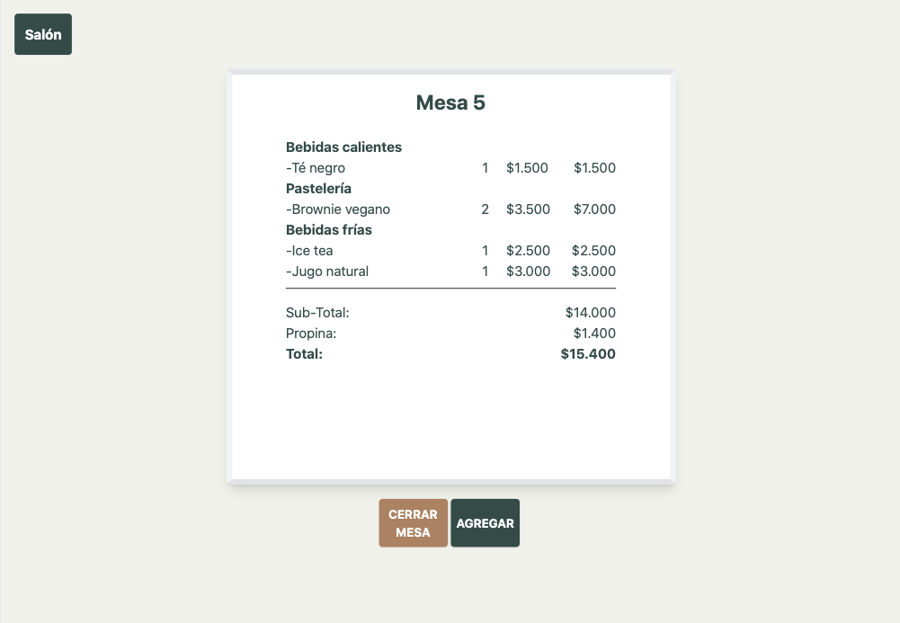
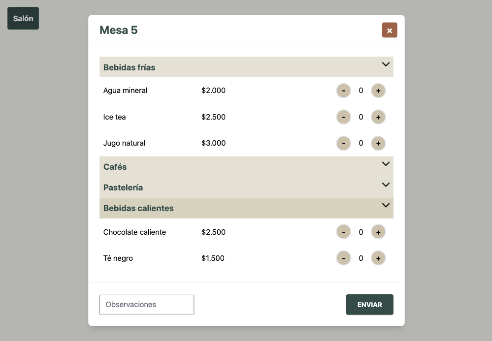
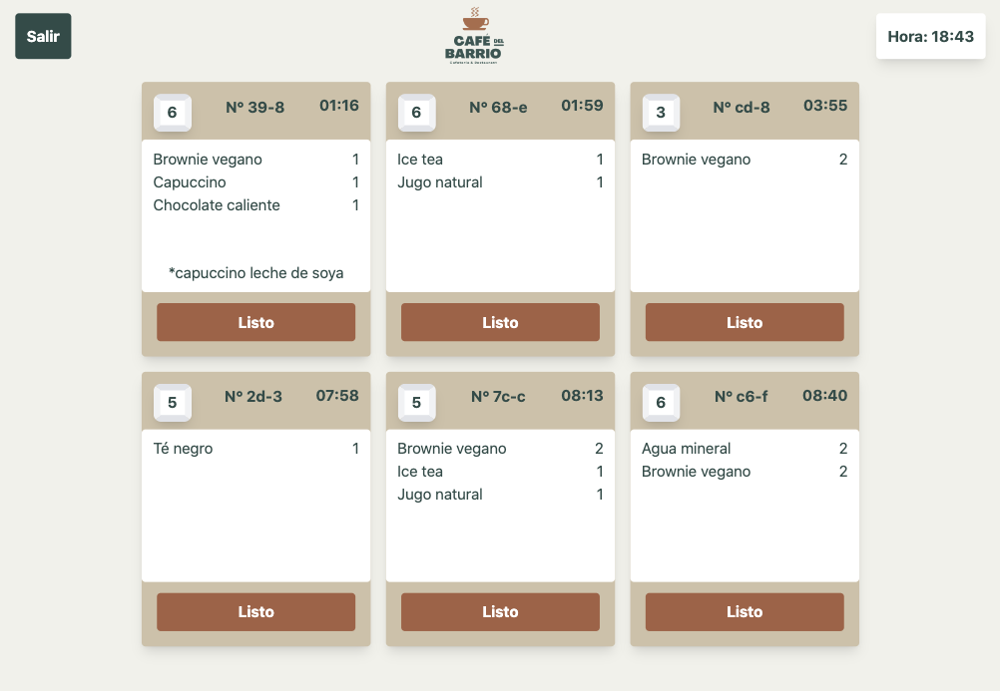

# Café del Barrio

*Café del Barrio* es una _Single Page App_ para la gestión de pedidos de un restaurant, con énfasis en la conexión entre meser@ y cocina.  
Su objetivo es aumentar la eficiencia en la toma y entrega de pedidos a los clientes, por lo que cuenta con una interfaz minimalista e intuitiva, con el foco puesto en las comandas, mostrando el tiempo desde su creación (cronómetro) y su estado.   
Además permite diferentes menús según el horario y una visualización general de los pedidos por mesa con su costo total.

*Café del Barrio* fue desarrollada con React, Firebase, Tailwind y Vite.

## Pruébala pinchando [aquí](https://scl-020-burger-queen-eta.vercel.app/) 👈     

## 2. Historias de usuario
La plataforma está adaptada para ser usada en una tablet, y cuenta con dos perfiles de uso, de mesero/a y de cocina.
Tenemos 2 menús: desayuno y almuerzo

>### [1] Mesero/a debe poder tomar pedido de cliente 
- no depender de mi mala memoria
- saber cuánto cobrar
- enviarlo a la cocina y que se puedan ir preparando en orden.

#### Criterios de aceptación
* Identificar mesa.
* Agregar productos al pedido.
* Eliminar productos.
* Ver resumen y el total de la compra.
* Enviar pedido a cocina (guardar en alguna base de datos).
* Se ve y funciona bien en una _tablet_

>### [2] Jefe/a de cocina debe ver los pedidos

- ver los pedidos en orden
- marcar pedidos listos para avisar a lxs meserxs

#### Criterios de aceptación

* Ver los pedidos ordenados según se van haciendo.
* Marcar los pedidos que se han preparado y están listos para servirse.
* Ver el tiempo que tomó preparar el pedido desde que llegó hasta que se
  marcó como completado.

>### [3] Mesero/a debe ver pedidos listos para servir

- entregarlos rápidamente a los clientes que las hicieron.

#### Criterios de aceptación

* Ver listado de pedidos listos para servir.
* Marcar pedidos que han sido entregados.

## 3. Interfaz de usuario

